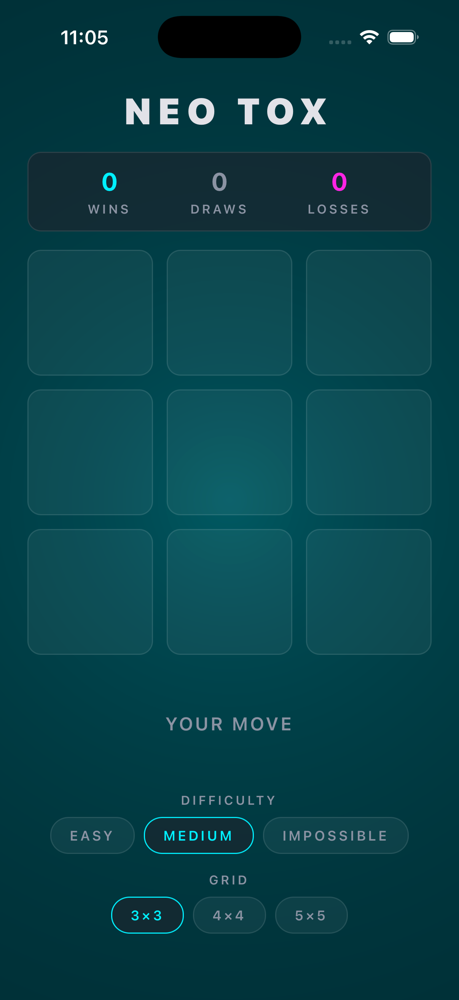
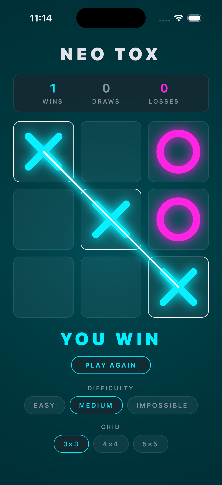
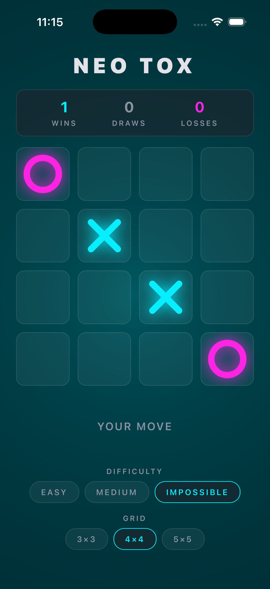
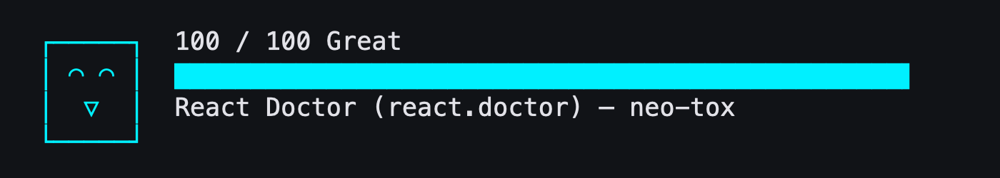

# Neo Tox

A premium, cyber-aesthetic **N×N tic-tac-toe** game for iOS and Android, built with
**Expo SDK 57**, **React Native 0.86**, **React Native Skia**, **Reanimated 4**, and **Zustand**.

You play **X** against a minimax computer opponent with three difficulty levels —
including an unbeatable one — on a **3×3, 4×4, or 5×5** board.

<p align="center"><em>GPU shader background · self-drawing neon markers · laser winning strike · haptic feedback · persistent stats</em></p>

## Demo

<p align="center">
  
</p>

<p align="center"><em>A full game loop in 18 seconds: staggered board entrance, self-drawing markers, the AI "computing" pulse, the winning laser strike with the YOU WIN banner, then a live switch to a 4×4 grid.</em></p>

> 🎬 Prefer video? [Watch the MP4 (443 KB)](docs/media/demo.mp4)

## Screenshots

| Home — shader glow & stats | Victory — laser strike | N×N — 4×4 vs IMPOSSIBLE |
|:---:|:---:|:---:|
|  |  |  |

---

## Features

- **Single-player vs. AI** — minimax with alpha-beta pruning, center-first move
  ordering, and depth-limited search with an open-line heuristic so larger boards
  stay instant.
  - `EASY` — makes deliberate mistakes 40% of the time
  - `MEDIUM` — shallow lookahead; blocks threats but can be outplayed
  - `IMPOSSIBLE` — perfect play on 3×3 (provably never loses)
- **Scalable N×N board** — the engine, board, and win-strike overlay are all
  driven by a single `gridSize` value. 3×3 / 4×4 / 5×5 are exposed in the UI;
  nothing in the code is hardcoded to 3.
- **Animations, GPU-first**
  - SkSL runtime shader background (breathing neon glow) evaluated on the GPU
  - Markers draw themselves in with stroked path trims + neon glow shadows
  - Spring-animated laser strike across the winning line
  - Staggered cell entrance, layout springs on grid-size change, pulsing
    "AI computing" state
- **Haptics** mapped to game events (move, win, loss, invalid tap)
- **Persistent stats** (wins / draws / losses) and settings via Zustand + AsyncStorage
- **Zero magic numbers** — every color, distance, duration, ratio, physics
  constant, and shader tuning value lives in `src/theme/tokens.ts` or is a
  named module constant
- **Accessibility** — every interactive element has a role, label, and state

## Architecture

```
src/
├── theme/tokens.ts          # Single source of truth for ALL design values
├── engine/GameEngine.ts     # Pure N×N game + AI engine (no React imports)
├── store/useGameStore.ts    # Zustand store; persistence; AI turn orchestration
├── utils/haptics.ts         # Hardware feedback mapped to logical events
├── hooks/useBoardMetrics.ts # Shared board geometry (grid + overlay never drift)
├── components/
│   ├── ShaderBackground.tsx # SkSL GPU shader
│   ├── NeonMarker.tsx       # Self-drawing X / O glyphs (Skia)
│   ├── GameBoard.tsx        # N×N touch grid
│   ├── WinningStrike.tsx    # Laser win overlay (Skia)
│   ├── ScoreBoard.tsx       # Persistent session record
│   ├── StatusBanner.tsx     # Turn state / result / play again
│   └── SegmentedSelector.tsx# Reusable pill selector (difficulty + grid size)
├── screens/GameScreen.tsx
└── __tests__/               # 25 unit tests (engine + store)
```

Key decisions:

- **Engine is pure TypeScript** — fully testable, no React or native imports.
  The store orchestrates turns; components only render state.
- **The AI never loses on 3×3** — verified by a seeded self-play test that runs
  25 complete games in CI.
- **A stale-turn guard** (`gameId`) makes resets during the AI's "thinking"
  delay race-free.
- **One geometry hook** feeds both the touchable grid and the Skia strike
  overlay, so they can never disagree about cell positions.

## Running on a Mac (mini)

### Prerequisites

1. **Xcode** from the Mac App Store (open it once to accept the license)
2. **Node 20+** — `brew install node` or via nvm
3. **CocoaPods** — `brew install cocoapods`

### Run it

```bash
git clone <this-repo>
cd neo-tox
npm install

# Build and launch on the iOS Simulator (first build takes a few minutes)
npx expo run:ios
```

> The project uses native modules (Skia, Reanimated), so it will not run in
> Expo Go — `expo run:ios` builds a development client automatically.
> To target a specific simulator: `npx expo run:ios --device "iPhone 17 Pro"`.

### Tests & checks

```bash
npm test           # 25 unit tests (engine + store)
npm run typecheck  # strict TypeScript
```

## Code health



The full codebase scores **100/100** on [React Doctor](https://react.doctor)
(security, performance, correctness, and architecture scan). Reproduce with:

```bash
npx react-doctor@latest .
```

## Requirements compliance

| Requirement | Where it's satisfied |
|---|---|
| Single-player tic-tac-toe vs. a computer player | Minimax AI with three difficulties — `src/engine/GameEngine.ts` |
| AI prompt history included | [PROMPTS.md](./PROMPTS.md) — full two-phase history, including deviations and debugging |
| **No magic numbers** | Every design value lives in [`src/theme/tokens.ts`](./src/theme/tokens.ts); remaining values are named module constants (e.g. `EASY_MISTAKE_PROBABILITY`, `WIN_SCORE`) |
| **Animations included** | Shader background, marker draw-in, pop-in springs, winning strike, layout springs, thinking pulse — see [Demo](#demo) |
| **Animations run smoothly** | GPU-first: SkSL shader + Skia canvases; Reanimated worklets run on the UI thread; AI search is depth-limited to stay off the frame budget |
| **Code scalable to N×N** | Engine, board, geometry, and strike all derive from one `gridSize`; 3×3 / 4×4 / 5×5 in the UI; `getWinningLines(n)` works for any `n` |
| **Tested before sending** | 25 unit tests + strict tsc + production bundle + full native build exercised on the iOS Simulator (screenshots above are from those runs) |
| Runs on a Mac (mini) | [Running on a Mac](#running-on-a-mac-mini) — three prerequisites and one command |

## AI prompt history

Per the submission requirements, the complete prompt history used to build this
project is documented in [PROMPTS.md](./PROMPTS.md).
